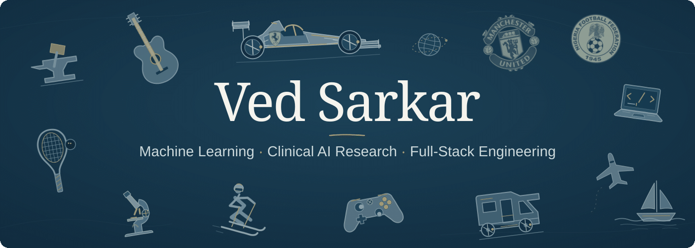

  

Hi, I’m Ved, a **UC Berkeley Data Science grad (2025)** working across AI/ML, full-stack software, and healthcare research. I like building stuff by rearranging either atoms by smacking them at an anvil or bits by smashing my keyboard constantly. Reshaping iron or resolving syntax to make life easier one commit at a time.

My ideas often start with the friction I encounter as a heavy user of AI tools and emerging technologies. I’m drawn to hard, unexplored problems where out of-the-box engineering can make a meaningful difference. That curiosity extends beyond technology, a bit of everywhere has shaped me. I grew up across four continents, multiple countries and cultures, and I’m still happiest exploring somewhere new.

At **TCG Digital**, I design interoperable AI agents with **A2A, MCP and LangGraph**, spanning travel planning and design-of-experiments workflows. My work covers agent discovery/task contracts, statistical-tool integration, and prototypes that carry experiment results into subsequent runs.

As an **ML researcher at NHS NCA**, I’ve co-authored and led clinical AI research with collaborators at **OpenAI, NYU Langone Health and Mount Sinai**. I develop and externally validate machine-learning models for neurosurgical triage, MRI analysis and operative-note NLP, working with clinicians on interpretable models and peer-reviewed publications.

As a **founding engineer at EnvoyX**, I built the foundations of a multi-tenant fintech platform, connecting document intake and extraction with structured financial records, claims dashboards, and auditable workflows. My work spanned the product’s interfaces, backend services, authentication, and data models.

I work across the full path from an idea to a working system: designing data flows, testing ML models, coordinating agents, and building the interfaces and backend services that bring them together.

[Projects](#projects) · [Selected Research](#selected-research)  · [Google Scholar](https://scholar.google.com/citations?user=I3JwF4YAAAAJ&hl=en) · [Beyond Tech](#beyond-tech)

## Projects

### [Meeting Loop](https://github.com/ved-sarkar/meeting-loop)

**A macOS meeting copilot for live assistance, shared context, and agent-ready follow-through.**

- **During the meeting:** a floating copilot helps with what to say, catches you up, and recalls decisions using available transcript evidence and project context.
- **Afterward:** reviewable tasks and source-linked handoff files carry the conversation into approved local drafts or another explicitly connected agent.
- **Next time:** persistent project memory brings forward current task state and checked artifacts, including cancellations and changed work.

Built with **React, Electron, Swift, SQLite, Ollama, and whisper.cpp**. The default content path runs locally. Five read-only MCP tools expose meeting search, transcripts, project briefs, and task state to a configured assistant. External execution stays with that agent’s host and the user’s permissions.

Meeting Loop is a personal prototype; live-call endurance and fresh-machine setup remain unvalidated.

[Explore the code](https://github.com/ved-sarkar/meeting-loop) · [Architecture](https://github.com/ved-sarkar/meeting-loop/blob/main/docs/ARCHITECTURE.md) · [Example walkthrough](https://github.com/ved-sarkar/meeting-loop/blob/main/docs/DEMO.md) · [Feature status](https://github.com/ved-sarkar/meeting-loop/blob/main/STATUS.md)

### More Projects

- [**Auto-Podcast**](https://github.com/ved-sarkar/Auto-Podcast): a React workspace for reviewing interview-transcript edits. Shows the source, proposed cut, and removed passages, with deletion-only validation and a fictional offline demo. Exports edited text.
- [**Storage Tracker**](https://github.com/ved-sarkar/Storage-Tracker): a SwiftUI macOS app for tracking stored belongings, locations, estimated value, and last use. Includes item editing, validation, and atomic local JSON persistence.
- [**MLTool**](https://github.com/ved-sarkar/MLTool): a Tkinter research prototype that guides Excel data through preprocessing, feature selection, classifier comparison, and local export. Built around scikit-learn and XGBoost, with cross-validation scores and confusion-matrix views.
- [**DECHOR**](https://github.com/ved-sarkar/DECHOR): a Shiny for Python interface around a saved decision-tree model for chronic subdural haematoma referral-outcome research. Explores form inputs, preprocessing, and prediction displays; it is not a validated clinical tool.
- [**Stethalyser**](https://github.com/ved-sarkar/Stethalyser): Arduino and Python experiments in audio acquisition, waveform visualization, filtering, and recording. An exploratory hardware/audio prototype, with sender and receiver protocols still needing integration.
- [**Faker Text Lab**](https://github.com/ved-sarkar/Faker-Text-Lab): Python experiments with tagged-text substitution, generated names and phone numbers, spreadsheet processing, and regex/local-model redaction. Includes a fictional input example; the current experiments do not establish reliable anonymization.
- [**TrackBite**](https://github.com/ved-sarkar/TrackBite): a documented concept for combining food-weight input, ingredient photos, and a reviewed meal log. Explores the proposed interaction and data boundaries; camera recognition, nutrition estimation, and logging are not implemented.

## Selected Research

I’ve coauthored work on medical imaging, clinical text, and diagnostic prediction models in neurosurgical care.

- [Development of a Machine-Learning Algorithm to Identify Cauda Equina Compression on Magnetic Resonance Imaging Scans](https://pubmed.ncbi.nlm.nih.gov/39826832/)  
  *World Neurosurgery · 2025*
- [Clinicosocial determinants of hospital stay following cervical decompression: A public healthcare perspective and machine learning model](https://pubmed.ncbi.nlm.nih.gov/38821028/)  
  *Journal of Clinical Neuroscience · 2024*
- [Natural language processing for the automated detection of intra-operative elements in lumbar spine surgery](https://www.frontiersin.org/journals/surgery/articles/10.3389/fsurg.2023.1271775/full)  
  *Frontiers in Surgery · 2023*
- [Predicting neurosurgical referral outcomes in patients with chronic subdural hematomas using machine learning algorithms – A multi-center feasibility study](https://pubmed.ncbi.nlm.nih.gov/36751456/)  
  *Surgical Neurology International · 2023*

[**All papers on Google Scholar →**](https://scholar.google.com/citations?user=I3JwF4YAAAAJ&hl=en)

## Beyond Tech

Outside tech, I was in a band in a different life once and still enjoy jamming with a guitar, playing squash, skiing and blacksmithing. I’m a big Manchester United, Naija Super Eagles and Ferrari F1 fan, with a passion for flying, sailing and RVing. Growing up across countries and cultures has made me curious about people and places. I love meeting new people, trading ideas and perspectives, and picking up new hobbies and skills along the way. Reach out, I am always down for new chats, new friends and definitely new adventures!!
