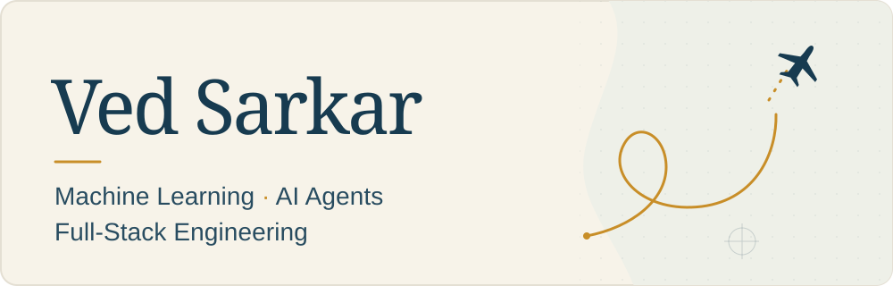

  

I’m Ved, a **UC Berkeley Data Science graduate (B.A., Fall 2025)** working across AI/ML engineering, full-stack software, and healthcare research. I’m drawn to hard, underexplored problems where careful engineering can make a meaningful difference. Many of my project ideas start with friction I run into as a frequent user of AI tools.

At **TCG Digital**, I design interoperable AI agents with **A2A, MCP and LangGraph**, spanning travel planning and design-of-experiments workflows. My work covers agent discovery/task contracts, statistical-tool integration, and prototypes that carry experiment results into subsequent runs.

As a **founding engineer at EnvoyX**, I built a multi-tenant fintech platform with React/Next.js, NestJS and PostgreSQL, plus a Document AI/OpenAI extraction pipeline for document processing.

At **NCA**, I work on clinical ML for imaging and NLP, including external-validation research on **NYU Langone’s NYUTron** and **OpenAI-supported vision-model evaluation** for cauda equina compression. Our wider group’s collaborations include Ehlers-Danlos questionnaire research with **Mount Sinai**.

Across work and personal projects, I use **React and Next.js, Node.js and NestJS, Python, and SQL**.

[Projects](#projects) · [Selected Research](#selected-research) · [Beyond Tech](#beyond-tech) · [Google Scholar](https://scholar.google.com/citations?user=I3JwF4YAAAAJ&hl=en)

## Projects

### [Meeting Loop](https://github.com/ved-sarkar/meeting-loop)

**A macOS meeting copilot for live assistance, shared context, and agent-ready follow-through.**

- **During the meeting:** a floating copilot helps with what to say, catches you up, and recalls decisions using available transcript evidence and project context.
- **Afterward:** reviewable tasks and source-linked handoff files carry the conversation into approved local drafts or another explicitly connected agent.
- **Next time:** persistent project memory brings forward current task state and checked artifacts, including cancellations and changed work.

Built with **React, Electron, Swift, SQLite, Ollama, and whisper.cpp**. The default content path runs locally. Five read-only MCP tools expose meeting search, transcripts, project briefs, and task state to a configured assistant. External execution stays with that agent’s host and the user’s permissions.

Meeting Loop is a personal prototype; live-call endurance and fresh-machine setup remain unvalidated.

[Explore the code](https://github.com/ved-sarkar/meeting-loop) · [Architecture](https://github.com/ved-sarkar/meeting-loop/blob/main/docs/ARCHITECTURE.md) · [Example walkthrough](https://github.com/ved-sarkar/meeting-loop/blob/main/docs/DEMO.md) · [Feature status](https://github.com/ved-sarkar/meeting-loop/blob/main/STATUS.md)

### More Projects

- [**Auto-Podcast**](https://github.com/ved-sarkar/Auto-Podcast): a React workspace for reviewing interview-transcript edits. Shows the source, proposed cut, and removed passages, with deletion-only validation and a fictional offline demo. Exports edited text.
- [**Storage Tracker**](https://github.com/ved-sarkar/Storage-Tracker): a SwiftUI macOS app for tracking stored belongings, locations, estimated value, and last use. Includes item editing, validation, and atomic local JSON persistence.
- [**MLTool**](https://github.com/ved-sarkar/MLTool): a Tkinter research prototype that guides Excel data through preprocessing, feature selection, classifier comparison, and local export. Built around scikit-learn and XGBoost, with cross-validation scores and confusion-matrix views.
- [**DECHOR**](https://github.com/ved-sarkar/DECHOR): a Shiny for Python interface around a saved decision-tree model for chronic subdural haematoma referral-outcome research. Explores form inputs, preprocessing, and prediction displays; it is not a validated clinical tool.
- [**Stethalyser**](https://github.com/ved-sarkar/Stethalyser): Arduino and Python experiments in audio acquisition, waveform visualization, filtering, and recording. An exploratory hardware/audio prototype, with sender and receiver protocols still needing integration.
- [**Faker Text Lab**](https://github.com/ved-sarkar/Faker-Text-Lab): Python experiments with tagged-text substitution, generated names and phone numbers, spreadsheet processing, and regex/local-model redaction. Includes a fictional input example; the current experiments do not establish reliable anonymization.
- [**TrackBite**](https://github.com/ved-sarkar/TrackBite): a documented concept for combining food-weight input, ingredient photos, and a reviewed meal log. Explores the proposed interaction and data boundaries; camera recognition, nutrition estimation, and logging are not implemented.

## Selected Research

I’ve coauthored work on medical imaging, clinical text, and prediction in neurosurgical care.

- [Development of a Machine-Learning Algorithm to Identify Cauda Equina Compression on Magnetic Resonance Imaging Scans](https://pubmed.ncbi.nlm.nih.gov/39826832/)  
  *World Neurosurgery · 2025*
- [Clinicosocial determinants of hospital stay following cervical decompression: A public healthcare perspective and machine learning model](https://pubmed.ncbi.nlm.nih.gov/38821028/)  
  *Journal of Clinical Neuroscience · 2024*
- [Natural language processing for the automated detection of intra-operative elements in lumbar spine surgery](https://www.frontiersin.org/journals/surgery/articles/10.3389/fsurg.2023.1271775/full)  
  *Frontiers in Surgery · 2023*
- [Predicting neurosurgical referral outcomes in patients with chronic subdural hematomas using machine learning algorithms – A multi-center feasibility study](https://pubmed.ncbi.nlm.nih.gov/36751456/)  
  *Surgical Neurology International · 2023*

[**All papers on Google Scholar →**](https://scholar.google.com/citations?user=I3JwF4YAAAAJ&hl=en)

## Beyond Tech

Outside tech, I’m into music, squash, skiing and blacksmithing, and I’m a big Manchester United fan. I’m passionate about flying, sailing, RVing, and exploring wherever I can, however I can.
